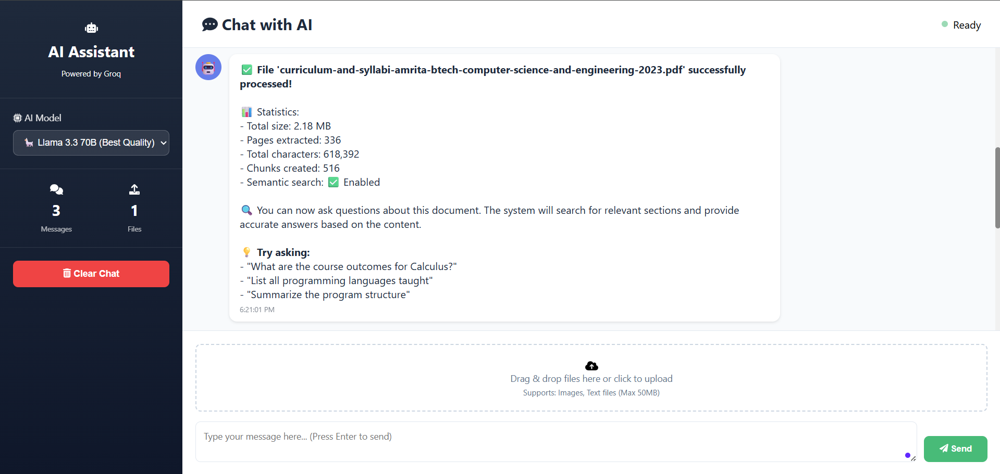

<h1 align="center">🤖 Groq RAG Chatbot</h1>

<b>Smart Document Q&A with Retrieval-Augmented Generation (RAG)</b>

  
  
  
  

  <!-- 🔥 CHANGE THIS PATH TO YOUR IMAGE -->
  

<h2>📌 Overview</h2>

This project allows you to <b>upload large PDF documents (300+ pages)</b> and ask questions in plain English. 
It uses <b>Retrieval-Augmented Generation (RAG)</b> to provide accurate, context-aware answers.

<h3>🎯 Use Cases</h3>

<ul>
<li>📚 Students – Query textbooks, syllabi, research papers</li>
<li>👨‍💼 Professionals – Analyze contracts and reports</li>
<li>🔬 Researchers – Search academic documents</li>
<li>📖 Teachers – Build interactive Q&A systems</li>
</ul>

<h2>⭐ Features</h2>

<ul>
<li>📚 Supports large PDFs (300+ pages)</li>
<li>🔍 Semantic search using embeddings</li>
<li>🧠 Efficient RAG pipeline</li>
<li>⚡ Ultra-fast inference with Groq</li>
<li>💬 Clean and responsive UI</li>
<li>🔒 API key stays local (secure)</li>
</ul>

<h2>🏗️ Architecture</h2>

<pre>
PDF → Chunking → Embeddings → FAISS Index
                             ↓
User Query → Embedding → Top-K Retrieval → Groq LLM → Answer
</pre>

<h2>🛠️ Tech Stack</h2>

<table>
<tr><th>Technology</th><th>Purpose</th></tr>
<tr><td>Flask</td><td>Backend framework</td></tr>
<tr><td>Groq API</td><td>LLM inference</td></tr>
<tr><td>Sentence Transformers</td><td>Text embeddings</td></tr>
<tr><td>FAISS</td><td>Vector search</td></tr>
<tr><td>PyPDF2 / pdfplumber</td><td>PDF extraction</td></tr>
</table>

<h2>📋 Prerequisites</h2>

<ul>
<li>Python 3.8+</li>
<li>Git</li>
<li>Groq API Key</li>
</ul>

<h2>🚀 Installation</h2>

<pre>
git clone https://github.com/ysujith728/groq-chatbot-rag.git
cd groq-chatbot-rag
</pre>

<pre>
# Create virtual environment
python -m venv venv

# Activate (Windows)
venv\Scripts\activate

# Activate (Mac/Linux)
source venv/bin/activate
</pre>

<pre>
pip install -r requirements.txt
</pre>

<pre>
# Create .env file
GROQ_API_KEY=your_api_key_here
</pre>

<pre>
python app.py
</pre>

<b>Open:</b> http://localhost:5000

<h2>💬 Example Questions</h2>

<ul>
<li>What are the course outcomes?</li>
<li>List all programming languages taught</li>
<li>What is the credit distribution?</li>
<li>Summarize the objectives</li>
<li>What AI electives are available?</li>
</ul>

<h2>📊 Performance</h2>

<table>
<tr><th>Metric</th><th>Value</th></tr>
<tr><td>Max PDF Size</td><td>100MB</td></tr>
<tr><td>Pages</td><td>~500</td></tr>
<tr><td>Chunk Size</td><td>1500 chars</td></tr>
<tr><td>Response Time</td><td>2–5 sec</td></tr>
<tr><td>Embedding Model</td><td>all-MiniLM-L6-v2</td></tr>
</table>

<h2>📁 Project Structure</h2>

<pre>
groq-chatbot-rag/
│
├── app.py
├── requirements.txt
├── .env.example
├── README.md
├── LICENSE
│
├── templates/
│   └── index.html
│
├── uploads/        (ignored)
├── chunks/         (ignored)
└── screenshots/
    └── demo.png
</pre>

<h2>🐛 Troubleshooting</h2>

<b>RAG not working</b>

<pre>pip install sentence-transformers faiss-cpu numpy</pre>

<b>API Key issue</b>

<pre>GROQ_API_KEY=your_key</pre>

<b>PDF issue</b>

<ul>
<li>Ensure PDF has selectable text (not scanned)</li>
</ul>

<h2>🤝 Contributing</h2>

<ol>
<li>Fork the repo</li>
<li>Create branch: <code>feature/your-feature</code></li>
<li>Commit changes</li>
<li>Push and open PR</li>
</ol>

<h2>📄 License</h2>

MIT License

<h2>⭐ Support</h2>

<ul>
<li>⭐ Star the repo</li>
<li>🔁 Share it</li>
<li>🤝 Contribute</li>
</ul>

<h2 align="center">❤️ Built With</h2>

Groq’s ultra-fast inference engine

